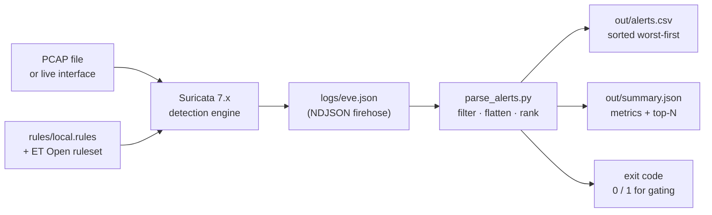

# Network IDS with Suricata


A working network intrusion detection pipeline: capture traffic, detect on it with
Suricata, and turn the raw alert stream into a triage queue an analyst can actually
work through. Built and tuned to run on a MacBook Air M1 with 8 GB of RAM.

**Measured:** 9/9 detection rules fire against a 133-packet ground-truth capture on Suricata 8.0.7 — 100% rule coverage, zero false negatives. Reproduce with `make live`.

The interesting part is not "I installed Suricata." It is the second half — raw
`eve.json` is a firehose of newline-delimited JSON, and the job of an L1/L2 analyst
is to go from that firehose to *which three things do I look at first*. That
reduction is what `parse_alerts.py` implements.

---

## Pipeline



---

## Quickstart

```bash
git clone https://github.com/Shivam-kumar-jha/Network-IDS.git
cd Network-IDS

# 1. Demo with zero setup — no Suricata, no root, no PCAP needed.
bash scripts/demo.sh

# 2. Real install (macOS, Apple Silicon)
bash scripts/setup.sh

# 3. Real detection run against a capture
bash scripts/run_suricata.sh -r data/output.pcap
python3 scripts/parse_alerts.py -i logs/eve.json -o out/alerts.csv --json out/summary.json
```

`demo.sh` auto-detects what's available. With Suricata and a PCAP present it does a
real detection run; otherwise it generates a representative `eve.json` and runs the
same parser over it. Same code path, same output — so the project demos on a laptop
that has nothing installed.

**No third-party Python dependencies.** `parse_alerts.py` is stdlib only (`json`,
`csv`, `argparse`, `collections`). Nothing to `pip install`, nothing to break.

---

## Repository layout

```
Network-IDS/
├── config/
│   └── suricata.yaml          Tuned config — memory caps sized for 8 GB
├── rules/
│   └── local.rules            10 custom rules, SID 1000001–1000010
├── scripts/
│   ├── setup.sh               Idempotent install + rule validation
│   ├── run_suricata.sh        Offline PCAP or live capture wrapper
│   ├── gen_sample_eve.py      Synthetic EVE generator (seeded, reproducible)
│   ├── gen_test_pcap.py       Ground-truth PCAP — real packets, known labels
│   ├── parse_alerts.py        eve.json → triage CSV + summary
│   ├── score_detection.py     Coverage vs ground truth (finds broken rules)
│   └── demo.sh                End-to-end, auto-detects live vs synthetic
├── data/                      PCAPs go here (gitignored)
├── logs/                      Suricata output (gitignored)
├── out/                       Parsed artifacts (gitignored)
└── docs/
    ├── METRICS.md             How this is measured, with real numbers
    └── INTERVIEW.md           Talking points + the questions you'll get asked
```

---

## Measuring detection, not asserting it

`gen_test_pcap.py` builds a real PCAP from scratch — valid Ethernet/IP/TCP/UDP
frames with correct checksums, full TCP handshakes, 133 packets — carrying traffic
engineered to trigger 9 of the 10 rules. Because it emits its own ground-truth
labels, coverage is directly computable:

```bash
make live     # PCAP -> Suricata -> parse -> score, in one command
```

```
  [PASS]  SID 1000001  x1    Nmap NSE user-agent
  [PASS]  SID 1000005  x1    Log4j JNDI lookup in header
  [MISS]  SID 1000008  x0    abnormally long DNS label
  ...
  Coverage       : 88.9%
```

A `MISS` means the rule is broken — wrong sticky buffer, wrong flow direction, or
an app-layer parser that's switched off. Finding those with a scoring script beats
finding them in an interview.

This is also why the project doesn't need a malware sample to prove it works. Real
corpora like CTU-13 are still the right call for measuring against genuine attacker
behaviour, but for testing whether *your own rules* fire, you want traffic where you
wrote the labels yourself.

SID 1000009 (TLS SNI) isn't covered — a valid ClientHello is more than hand-crafted
packets should attempt. That one gets tested against live traffic.

## Detection content

Ten custom rules in `rules/local.rules`, mapped to MITRE ATT&CK:

| SID | Detection | Tactic | Technique |
|-----|-----------|--------|-----------|
| 1000001 | Nmap NSE user-agent | Reconnaissance | T1595 |
| 1000002 | Empty user-agent inbound | Defense Evasion | T1071 |
| 1000003 | SSH brute force (5+/60s, `threshold`) | Credential Access | T1110 |
| 1000004 | Cleartext password over HTTP | Credential Access | T1040 |
| 1000005 | Log4j JNDI lookup in header | Initial Access | T1190 |
| 1000006 | SQLi tautology in URI | Initial Access | T1190 |
| 1000007 | DNS query to sinkhole domain | Command and Control | T1071 |
| 1000008 | Abnormally long DNS label (tunnelling) | Exfiltration | T1048 |
| 1000009 | TLS SNI matching dynamic DNS | Command and Control | T1568 |
| 1000010 | `testmynids.org` canary | — | — |

Two choices worth calling out:

**SID 1000003 uses `threshold`, not a bare match.** A single failed SSH connection
is background noise on any internet-facing host. Five from the same source in sixty
seconds is a pattern. The counter is keyed `by_src` so it tracks the attacker rather
than the victim — key it the other way and one noisy scanner silences the rule for
every other host.

**SID 1000010 is a canary and it is not optional.** It fires on a request to
`testmynids.org`. If it stops firing, the pipeline is broken — Suricata isn't seeing
traffic, or the rules didn't load. Without a canary, a dead sensor and a quiet
network look identical from the dashboard. That distinction is the whole point.

---

## What the parser does

Raw `eve.json` mixes alerts with `flow`, `http`, `dns`, `stats` and other event
types — in the sample run, alerts are 20% of lines. `parse_alerts.py`:

- Skips non-alert events and survives malformed/truncated lines (a killed Suricata
  leaves a half-written final line; that is normal, not a crash)
- Flattens nested `alert{}`, `http{}`, `dns{}`, `tls{}` into one CSV row
- Pulls MITRE tactic/technique out of rule metadata where the ruleset provides it
- Sorts worst-first, so row 2 of the CSV is the first thing to investigate
- Ranks top signatures, categories, source IPs and conversations
- Returns exit code 1 when anything at or above `--fail-severity` appears, so it
  drops into CI or a cron job without extra glue

```bash
# Triage queue: severity 1 only
python3 scripts/parse_alerts.py -i logs/eve.json -o out/high.csv --min-severity 1

# Gating: non-zero exit if a sev-1 alert exists
python3 scripts/parse_alerts.py -i logs/eve.json -o out/a.csv --fail-severity 1 -q
```

---

## Sample output

```
========================================================================
  SURICATA ALERT TRIAGE SUMMARY
========================================================================
  Events read        : 600
  Alerts extracted   : 120
  Unique signatures  : 10
  Unique src / dst   : 15 / 15

  Severity           : high=49  medium=43  low=28

TOP SIGNATURES
--------------
     15  ########################  ET INFO Suspicious Empty User-Agent
     14  ######################    ET POLICY Outbound Connection to Tor Node
     13  #####################     GPL SHELLCODE x86 NOOP Sled Detected
```

Note what the ranking exposes: the *loudest* signature is an informational one, while
the sev-1 Cobalt Strike beacons sit further down the list. Sorting by volume is how
real alerts get buried. Sorting by severity first, volume second, is why the CSV is
ordered the way it is.

---

## Tuning for 8 GB / Apple Silicon

| Setting | Value | Why |
|---------|-------|-----|
| `detect.profile` | `low` | `high` preallocates matcher groups you don't need |
| `stream.memcap` | 128 MB | Stock is 64 MB→unbounded growth under load |
| `stream.reassembly.depth` | 1 MB | Most detections hit in the first megabyte |
| `flow.memcap` | 64 MB | Sized for a laptop's flow table, not a tap |
| `threading.detect-thread-ratio` | 0.5 | ~4 threads on 8 cores; more just adds contention |
| `app-layer` modbus/dnp3/enip/nfs | disabled | Industrial protocols you'll never see on a LAN |
| `pcap.checksum-checks` | `no` | macOS NICs offload checksums; leaving this on drops valid packets as "invalid" |

Steady-state RSS with this config lands around 400–600 MB, which leaves the machine
usable. The `checksum-checks` one costs people hours — offloaded checksums look
corrupt to Suricata, so it silently discards traffic you can see fine in Wireshark.

Homebrew on Apple Silicon installs to `/opt/homebrew`, not `/usr/local`. Every script
here resolves the prefix with `brew --prefix` rather than hardcoding it.

---

## Datasets

| Source | Use |
|--------|-----|
| [malware-traffic-analysis.net](https://www.malware-traffic-analysis.net/) | Labelled real malware PCAPs with write-ups |
| [CTU-13 / Stratosphere IPS](https://www.stratosphereips.org/datasets-ctu13) | Botnet captures with ground-truth labels |
| [Wireshark sample captures](https://wiki.wireshark.org/SampleCaptures) | Small, clean protocol samples |
| `testmynids.org` | Safe canary — generates a benign HTTP anomaly |
| `scripts/gen_sample_eve.py` | Seeded synthetic EVE, known ground truth |

Ground-truth labels are what make the metrics in `docs/METRICS.md` meaningful.
Without labels you can count alerts but you cannot compute a detection rate.

All IPs in the synthetic data use RFC 5737 documentation ranges (`192.0.2.0/24`,
`198.51.100.0/24`, `203.0.113.0/24`) — never routable, safe to publish.

---

## Next steps

- Feed `out/alerts.csv` into Project 2 (OpenSearch + Sigma) for correlation
- Enrich source IPs against MISP in Project 3
- Auto-create cases from sev-1 alerts in Project 5 (TheHive)
- Add `suricata -T` rule validation to CI so a malformed rule fails the build
